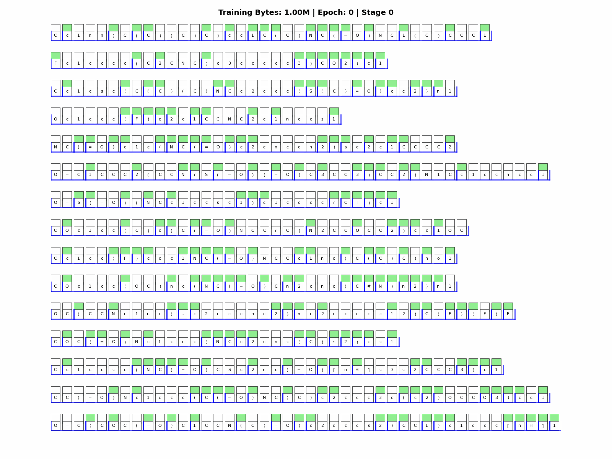
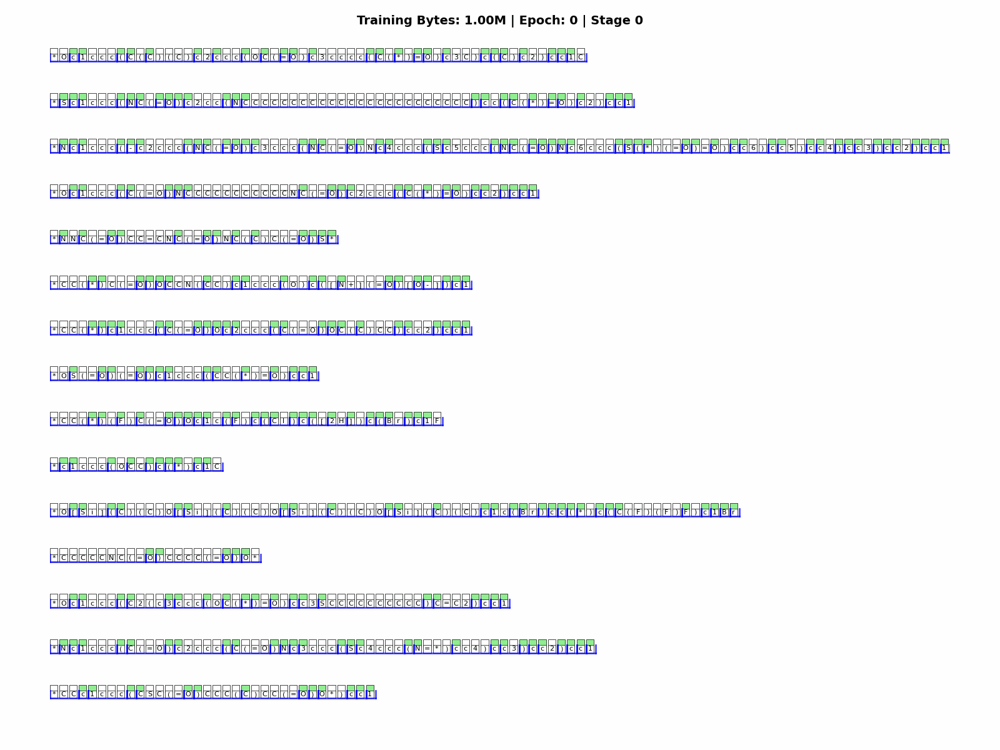

# Learning Chemical Grammar: Dynamic Tokenization for SMILES with H-Net

[](https://opensource.org/licenses/MIT)
[](https://www.python.org/downloads/)
[](https://pytorch.org/)

This repository contains the code, trained models, and analysis for **"Learning Chemical Grammar: Dynamic Tokenization for SMILES with Hierarchical Networks"** (ICML 2026 submission).

## 📄 Paper Abstract

Tokenization fundamentally shapes how machine learning models represent chemical structures. We investigate **dynamic tokenization** using Hierarchical Networks (H-Net), which learn byte-level chunking patterns directly from data. Our key findings:

| Finding | Result |
|---------|--------|
| **Dataset Specificity** | Only 30% token overlap between polymer and molecular vocabularies |
| **Training Dynamics** | 63% more unique tokens, 23% higher efficiency with extended training |
| **Downstream Performance** | H-Net embeddings outperform RDKit on BBBP (AUC 0.95 vs 0.93) and HIV (AUC 0.79 vs 0.76) |

## 🎬 Training Evolution Visualizations

H-Net learns to tokenize SMILES strings dynamically during training:

| Molecular Dataset (MOSES) | Polymer Dataset (PI1M) |
|---------------------------|------------------------|
|  |  |

---

## 📁 Project Structure

This project has **three main components**:

```
hnet_smiles/
├── Part A: Training ─────────────────────────────────────────────
│   ├── train_smiles.py          # Main training script
│   ├── generate_smiles.py       # SMILES generation
│   ├── configs/                 # Model configurations
│   ├── data/                    # Data loading modules
│   ├── datasets/                # PI1M and MOSES datasets
│   ├── visualizations/          # Training visualization tools
│   └── checkpoints/             # Trained models (gitignored)
│
├── Part B: Tokenization Analysis ────────────────────────────────
│   └── analysis/
│       ├── notebooks/           # Jupyter notebooks (01-08)
│       ├── utils/               # Inference and statistics utilities
│       ├── interpretability/    # Token interpretability analysis
│       ├── scaling/             # Scaling behavior analysis
│       ├── baselines/           # SmilesPE and BPE comparisons
│       └── FINAL_REPORT.md      # Comprehensive analysis report
│
├── Part C: Property Prediction ──────────────────────────────────
│   └── property_prediction/
│       ├── featurizers/         # H-Net and RDKit feature extraction
│       ├── models/              # XGBoost predictors
│       ├── scripts/             # Experiment automation
│       ├── experiments/         # Jupyter notebooks
│       └── results/             # Tables and figures
│
└── Publication ──────────────────────────────────────────────────
    └── publication_latex/       # ICML 2026 paper source
```

---

## 🚀 Quick Start

### Installation

```bash
# Clone the repository
git clone https://github.com/jordiferrero/hnet_smiles.git
cd hnet_smiles

# Create virtual environment
cd setup
./setup_env.sh
source ../venv/bin/activate

# Verify installation
python -c "import torch; print(f'PyTorch: {torch.__version__}')"
```

The setup script auto-detects your platform (CUDA, Mac M-chip, or CPU).

### Download Datasets

```bash
# PI1M polymer dataset (~995K SMILES)
# Already included: datasets/PI1M/PI1M_v2.csv

# MOSES molecular dataset (download separately due to size)
# See datasets/moses/README.md for instructions
```

### 📦 Pre-trained Models (Hugging Face)

All trained model checkpoints from the paper are available on Hugging Face:

**🔗 [H-Net SMILES Checkpoints Collection](https://huggingface.co/collections/jordiferrero/h-net-smiles-checkpoints-6973301c4e3d748569c70b98)**

| Model | Dataset | Training | Architecture | Download |
|-------|---------|----------|--------------|----------|
| **PI1M-68M** | PI1M | 68M bytes | 1-stage | [Link](https://huggingface.co/jordiferrero/PI1M-68M) |
| **PI1M-340M** | PI1M | 340M bytes | 1-stage | [Link](https://huggingface.co/jordiferrero/PI1M-340M) |
| **PI1M-1B** | PI1M | 1.05B bytes | 1-stage | [Link](https://huggingface.co/jordiferrero/PI1M-1B) |
| **PI1M-nocat** | PI1M | 340M bytes | 1-stage (no concat) | [Link](https://huggingface.co/jordiferrero/PI1M-nocat) |
| **PI1M-2stg** | PI1M | 340M bytes | 2-stage | [Link](https://huggingface.co/jordiferrero/PI1M-2stg) |
| **MOSES-340M** | MOSES | 340M bytes | 1-stage | [Link](https://huggingface.co/jordiferrero/MOSES-340M) |
| **MOSES-nocat** | MOSES | 340M bytes | 1-stage (no concat) | [Link](https://huggingface.co/jordiferrero/MOSES-nocat) |
| **MOSES-2stg** | MOSES | 340M bytes | 2-stage | [Link](https://huggingface.co/jordiferrero/MOSES-2stg) |

```python
# Quick download with Python
from huggingface_hub import hf_hub_download

checkpoint_path = hf_hub_download(
    repo_id="jordiferrero/PI1M-1B",
    filename="checkpoints/checkpoint_bytes_best.pt"
)
```

---

## Part A: Training H-Net on Chemical Data

Train H-Net models to learn dynamic tokenization from SMILES strings.

### Basic Training

```bash
# Edit configuration
nano configs/hnet_smiles_large.json

# Run training (GPU recommended)
python train_smiles.py --config configs/hnet_smiles_large.json
```

### Available Configurations

| Config | Model Size | Use Case |
|--------|------------|----------|
| `hnet_smiles_small.json` | ~50M params | Testing, debugging |
| `hnet_smiles_large.json` | ~350M params | Full training |
| `hnet_smiles_2stage_large.json` | ~350M params | Hierarchical architecture |

### Key Training Parameters

```json
{
  "arch_layout": ["m4", ["T22"], "m4"],  // 1-stage: Mamba-Transformer-Mamba
  "d_model": [1024, 1536],
  "training_config": {
    "data": "datasets/PI1M/PI1M_v2.csv",
    "epochs": 5,
    "batch_size": 16,
    "lr": 0.0001,
    "concatenate": true,           // Concatenate 10 SMILES per sample
    "checkpoint_bytes": 1000000    // Save every 1M bytes
  }
}
```

### Training Outputs

```
checkpoints/run_large_YYYYMMDD_HHMMSS/
├── checkpoints/
│   ├── checkpoint_epoch_*.pt      # Model checkpoints
│   └── checkpoint_bytes_best.pt   # Best model
├── visualizations/
│   ├── predictions/*.pkl.gz       # Boundary predictions
│   └── training_evolution_*.gif   # Evolution animations
└── metadata.json                  # Training history
```

### Background Training (SSH-safe)

```bash
nohup python train_smiles.py --config configs/hnet_smiles_large.json > training.log 2>&1 &
tail -f training.log  # Monitor progress
```

---

## Part B: Tokenization Analysis

Analyze learned tokenization patterns and compare with baselines.

### Analysis Notebooks

Navigate to `analysis/notebooks/` and run in order:

| Notebook | Purpose | GPU Required |
|----------|---------|--------------|
| `01_data_generation.ipynb` | Extract tokens from trained models | Yes |
| `02_dataset_nature_analysis.ipynb` | Compare polymer vs molecular | No |
| `03_concatenation_effect.ipynb` | Study concatenation impact | No |
| `04_training_amount_analysis.ipynb` | Analyze training dynamics | No |
| `05_benchmark_comparison.ipynb` | Compare with SmilesPE | No |
| `06_master_figure_token_distributions.ipynb` | Generate paper figures | No |
| `07_architecture_effect_analysis.ipynb` | 1-stage vs 2-stage | No |
| `08_compression_metrics_analysis.ipynb` | BPB and compression | No |

### Running Analysis

```bash
cd analysis

# Step 1: Generate tokenization data (requires GPU and trained models)
python run_data_generation.py

# Step 2: Run analysis notebooks
cd notebooks
jupyter notebook
```

### Key Analysis Scripts

```bash
# Test inference on a trained model
python analysis/test_inference.py \
    --checkpoint checkpoints/run_large_*/checkpoints/best_model.pt \
    --smiles "CCO" "c1ccccc1"

# Compare with SmilesPE baseline
python analysis/baselines/bpe_comparison.py
```

### Analysis Outputs

- **Figures**: `analysis/figures/` - Publication-ready plots
- **Statistics**: `analysis/data/statistics/` - JSON files with metrics
- **Report**: `analysis/FINAL_REPORT.md` - Comprehensive findings

---

## Part C: Property Prediction

Evaluate H-Net embeddings as chemical featurizers for property prediction.

### Tasks Evaluated

| Task | Type | Dataset Size | Best Result |
|------|------|--------------|-------------|
| **BBBP** | Classification | 2K | H-Net wins (AUC 0.95 vs 0.93) |
| **HIV** | Classification | 41K | H-Net wins (AUC 0.79 vs 0.76) |
| **Tg** (polymer) | Regression | 5K | Competitive (MAE 26.6°C vs 24.8°C) |
| **Lipophilicity** | Regression | 4K | RDKit wins |
| **ESOL** | Regression | 1K | RDKit wins |

### Running Property Prediction

```bash
cd property_prediction

# Setup environment
source setup_env.sh

# Step 1: Extract features from H-Net models (requires GPU)
python scripts/extract_all_features.py

# Step 2: Run all experiments
python scripts/run_all_experiments.py

# Step 3: View results
cat results/tables/comprehensive_results_final.csv
```

### Using H-Net as a Featurizer

```python
from property_prediction.featurizers import HNetFeaturizer

# Load trained H-Net model
featurizer = HNetFeaturizer(
    checkpoint_path="checkpoints/run_large_*/checkpoints/best_model.pt",
    pooling="mean"  # or "cls"
)

# Extract embeddings (768-dim)
smiles_list = ["CCO", "c1ccccc1", "CC(=O)O"]
embeddings = featurizer.featurize(smiles_list)  # Shape: (3, 768)
```

---

## 🔧 Trained Models

We provide the following pre-trained models (available upon request due to size):

| Model | Dataset | Epochs | Architecture | Training Bytes |
|-------|---------|--------|--------------|----------------|
| PI1M-5ep | PI1M (polymer) | 5 | 1-stage | 340M |
| PI1M-22ep | PI1M (polymer) | 22 | 1-stage | 1.05B |
| MOSES-5ep | MOSES (molecular) | 5 | 1-stage | 340M |
| PI1M-2stg | PI1M (polymer) | 5 | 2-stage | 340M |

---

## 📊 Reproducing Paper Results

### Table 5: Tokenizer Comparison

```bash
cd analysis
python baselines/bpe_comparison.py
```

### Figure 3: Token Overlap Heatmap

```bash
cd analysis/notebooks
jupyter notebook 02_dataset_nature_analysis.ipynb
```

### Table 6: Property Prediction

```bash
cd property_prediction
python scripts/run_all_experiments.py
```

---

## 📚 Citation

If you use this code, please cite:

```bibtex
@inproceedings{anonymous2026hnet_smiles,
  title={Learning Chemical Grammar: Dynamic Tokenization for {SMILES} with Hierarchical Networks},
  author={Anonymous},
  booktitle={International Conference on Machine Learning (ICML)},
  year={2026}
}
```

---

## 🔗 References

- **H-Net Paper**: [Hierarchical Networks with Learned Dynamic Chunking](https://arxiv.org/abs/2501.xxxxx) (Hwang et al., 2025)
- **Original H-Net Code**: https://github.com/goombalab/hnet
- **SmilesPE**: [SMILES Pair Encoding](https://github.com/XinhaoLi74/SmilesPE) (Li & Fourches, 2021)
- **PI1M Dataset**: https://github.com/RUIMINMA1996/PI1M
- **MOSES Dataset**: https://github.com/molecularsets/moses

---

## 🛠️ Troubleshooting

### Out of Memory

```bash
# Reduce batch size and increase gradient accumulation
python train_smiles.py --config configs/hnet_smiles_large.json \
    --batch-size 8 --gradient-accumulation 16
```

### Missing Dependencies

```bash
# Reinstall requirements
pip install -r setup/requirements.txt
pip install SmilesPE  # For baseline comparisons
```

### GPU Not Detected

```python
# Check PyTorch GPU support
import torch
print(f"CUDA available: {torch.cuda.is_available()}")
print(f"MPS available: {torch.backends.mps.is_available()}")  # Mac
```

---

## 📄 License

This project is licensed under the MIT License - see [LICENSE](LICENSE) for details.
